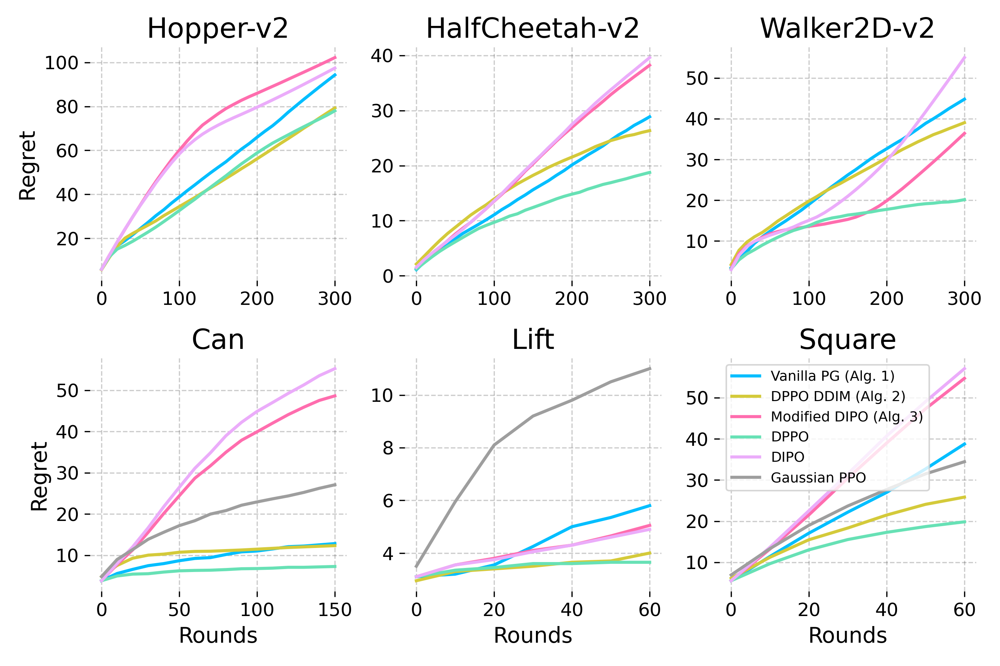
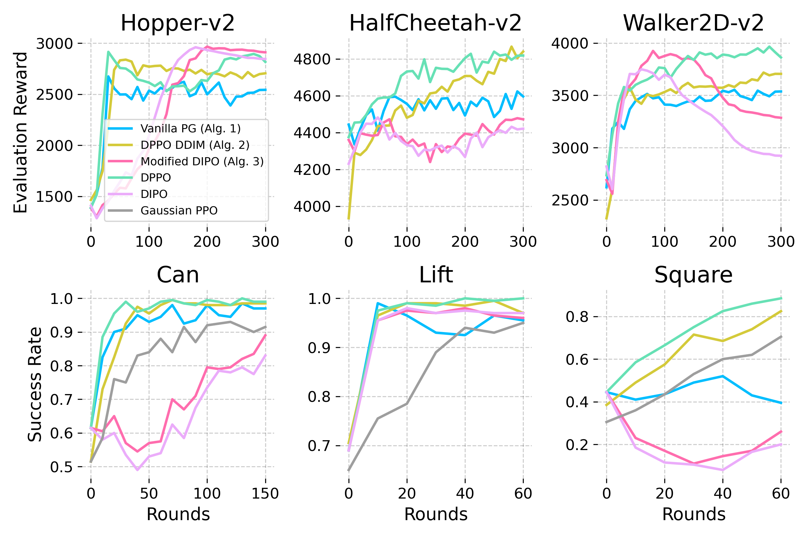

# Learning Diffusion Policies With Sublinear Regret

This repository governs the source code for the numerical experiments in the NeurIPS 2025 submission "Learning Diffusion Policies With Sublinear Regret". This was forked from Diffusion Policy Policy Optimization [(DPPO)](https://arxiv.org/abs/2409.00588) by Ren et al. (2024). 

The two main figures can be found in ``imgs/regret.png`` and ``imgs/reward.png``. 

### Results

We explore the regret that (practical versions of) our algorithms achieve {Hopper, Walker, HalfCheetah} Gym environments and {Can, Square, Lift} Robomimic environments. We compare these to the two algorithms that our paper is based on – DPPO from Ren et al. (2024) (Algs. 1 and 2) and DIPO from Yang et al. (2023) (Alg. 3). We also compare to a PPO-trained Gaussian policy on Robomimic.
- All experiments were performed on seed 42 – the exact same seed used by Ren et al. (2024). We apologize for not providing repetitions – our compute resources are limited, and we only had a week. As we use the same seed as them, we hope this, along with the fact that we seek to characterize the performance of diffusion policies rather than achieve SOTA results, assuages worries of seed-hacking. We will amend this in the final version. 
- Practical modifications include using a critic with generalized advantage estimation (as in Ren et al. (2024)), using PPO instead of NPG in Algorithm 2 for practicality, and setting $\beta = 0$ in Algorithm 3 to avoid computational inefficiency. 

 |Algorithm | Average Regret Rank | Average Best Value Rank |Fraction of Environments with Sublinear Regret|
| :--- | :--- | :--- | :--- |
| DPPO | 1.00 | 1.50 | 5/6 |
| DPPO+DDIM (Alg. 2) | 2.17 | 2.50 | 5/6 |
| Vanilla PG (Alg. 1) | 3.67 | 3.83 | 2/6 |
| Modified DIPO (Alg. 3) | 4.17 | 3.83 | 3/6 |
| Gaussian PPO | 4.33 | 4.17 | 3/3 |
| DIPO | 4.83 | 4.33 | 3/6 |

### Cumulative Regret


### Per-Episode Reward



## Writeup

We qualitatively describe the results here. 
- DPPO generally performs best, followed closely by DPPO+DDIM (Alg. 2). DPPO is outperformed by Alg. 2 on HalfCheetah-v2 and by behavior cloning algorithms on Hopper-v2. These methods achieve sublinear regret on 5 out of 6 environments.
- Vanilla PG (Alg. 1) proves surprisingly competitive, especially with reduced learning rates—one order of magnitude lower than PPO on Gym and two orders lower on Robomimic. This aligns well with our theory in Section 3 that suggests similar rates for Algorithms 1 and 2.
- Algorithm 3 outperforms DIPO except on Hopper-v2, validating our modifications (Lines 254-261) that address inconsistency in DIPO.
- Environment type strongly influences regret: behavior cloning algorithms achieve sublinear regret in Hopper-v2, whereas policy gradient methods do so in Walker2D-v2.
- We provide tables below of results. Results, presented below, report cumulative normalized regret: $\sum_{i=1}^t \frac{V^* - V^{(i)}}{V^*}$, ensuring interpretability.
- 
| Regret | Vanilla PG (Alg. 1) | DPPO+DDIM (Alg. 2) | Modified DIPO (Alg. 3) | DPPO | DIPO | Gaussian PPO | Number of Rounds
| :--- | :--- | :--- | :--- | :--- | :--- | :--- |  :--- |
| Hopper-v2  | 94 | 79 | 102 | 78 | 97 | -  | 300 |
| HalfCheetah-v2 | 29 | 26 | 38 | 19 | 40 | - | 300  |
| Walker2D-v2  | 45 | 39 | 36 | 20 | 55 | - | 300  |
| Can| 13 | 12 | 49 | 7 | 55 | 27 | 150  |
| Lift   | 6 | 4 | 5 | 4 | 5 | 11 | 60  |
| Square | 39 | 26 | 55 | 20 | 57 | 35 | 60  |

|  Clearly sublinear regret? | Alg. 1 | Alg. 2 | Alg. 3 | DPPO | DIPO | Gaussian PPO | 
| :--- | :--- | :--- | :--- | :--- | :--- | :--- | 
| Hopper-v2 | No | No | Yes | No | Yes | - |
| HalfCheetah-v2 | No | Yes | No | Yes | No | - |
| Walker2D-v2 | No | Yes | No | Yes | No | - |
| Can | Yes | Yes | Yes | Yes | Yes | Yes |
| Lift | Yes | Yes | Yes | Yes | Yes | Yes |
| Square | No | Yes | No | Yes | No | Yes |

| Best Obtained Value | Alg. 1 | Alg. 2 | Alg. 3 | DPPO | DIPO | Gaussian PPO | Optimal Value |
| :--- | :--- | :--- | :--- | :--- | :--- | :--- | :--- |
| Hopper-v2 | 2674 | 2839 | 2966 | 2915 | 2960 |  - | 3000 |
| HalfCheetah-v2 | 4623 | 4866 | 4478 | 4839 | 4482 | -  | 5000 |
| Walker2D-v2 | 3553 | 3718 | 3925 | 3966 | 3749 | - | 4000 |
| Can | 0.985 | 0.995 | 0.890 | 1.000 | 0.830 | 0.930 | 1 |
| Lift | 0.990 | 0.995 | 0.980 | 1.000 | 0.980 | 0.950 | 1 |
| Square | 0.520 | 0.825 | 0.445 | 0.885 | 0.445 | 0.705 | 1 |

## Reproduction

The experiments can be reproduced by choosing one of ``{hopper-v2, halfcheetah-v2, walker2d-v2}``, and running:
```
python script/run.py --config-name=ft_ppo_diffusion_mlp \
    --config-dir=cfg/gym/finetune/{hopper-v2, halfcheetah-v2, walker2d-v2}
python script/run.py --config-name=ft_ppo_ddim_diffusion_mlp \
    --config-dir=cfg/gym/finetune/{hopper-v2, halfcheetah-v2, walker2d-v2}
python script/run.py --config-name=ft_vpg_diffusion_mlp \
    --config-dir=cfg/gym/finetune/{hopper-v2, halfcheetah-v2, walker2d-v2}
python script/run.py --config-name=ft_clone_diffusion_mlp \
    --config-dir=cfg/gym/finetune/{hopper-v2, halfcheetah-v2, walker2d-v2}
python script/run.py --config-name=ft_dipo_diffusion_mlp \
    --config-dir=cfg/gym/finetune/{hopper-v2, halfcheetah-v2, walker2d-v2}
```
and similarly choosing one of ``{can, lift, square}``, and running:

```
python script/run.py --config-name=ft_ppo_diffusion_mlp \
    --config-dir=cfg/robomimic/finetune/{can, lift, square}
python script/run.py --config-name=ft_ppo_gaussian_mlp \
    --config-dir=cfg/robomimic/finetune/{can, lift, square}
python script/run.py --config-name=ft_ppo_ddim_diffusion_mlp \
    --config-dir=cfg/robomimic/finetune/{can, lift, square}
python script/run.py --config-name=ft_vpg_diffusion_mlp \
    --config-dir=cfg/robomimic/finetune/{can, lift, square}
python script/run.py --config-name=ft_clone_diffusion_mlp \
    --config-dir=cfg/robomimic/finetune/{can, lift, square}
python script/run.py --config-name=ft_dipo_diffusion_mlp \
    --config-dir=cfg/robomimic/finetune/{can, lift, square}
```

before running ``notebooks/analysis.ipynb``.

# Instructions from Ren et al. (2024)

## Installation 

1. Clone the repository

2. Install core dependencies with a conda environment (if you do not plan to use Furniture-Bench, a higher Python version such as 3.10 can be installed instead) on a Linux machine with a Nvidia GPU.
```console
conda create -n dppo python=3.8 -y
conda activate dppo
pip install -e .
```

3. Install specific environment dependencies (Gym / Kitchen / Robomimic / D3IL / Furniture-Bench) or all dependencies (except for Kitchen, which has dependency conflicts with other tasks).
```console
pip install -e .[gym] # or [kitchen], [robomimic], [d3il], [furniture]
pip install -e .[all] # except for Kitchen
```

4. [Install MuJoCo for Gym and/or Robomimic](installation/install_mujoco.md). [Install D3IL](installation/install_d3il.md). [Install IsaacGym and Furniture-Bench](installation/install_furniture.md)

5. Set environment variables for data and logging directory (default is `data/` and `log/`), and set WandB entity (username or team name)
```
source script/set_path.sh
```

## Usage - Pre-training

**Note**: You may skip pre-training if you would like to use the default checkpoint (available for download) for fine-tuning.

<!-- ### Prepare pre-training data

First create a directory as the parent directory of the pre-training data and set the environment variable for it.
```console
export DPPO_DATA_DIR=/path/to/data -->
<!-- ``` -->

Pre-training data for all tasks are pre-processed and can be found at [here](https://drive.google.com/drive/folders/1AXZvNQEKOrp0_jk1VLepKh_oHCg_9e3r?usp=drive_link). Pre-training script will download the data (including normalization statistics) automatically to the data directory.
<!-- The data path follows `${DPPO_DATA_DIR}/<benchmark>/<task>/train.npz`, e.g., `${DPPO_DATA_DIR}/gym/hopper-medium-v2/train.npz`. -->

### Run pre-training with data
All the configs can be found under `cfg/<env>/pretrain/`. A new WandB project may be created based on `wandb.project` in the config file; set `wandb=null` in the command line to test without WandB logging.
<!-- To run pre-training, first set your WandB entity (username or team name) and the parent directory for logging as environment variables. -->
<!-- ```console
export DPPO_WANDB_ENTITY=<your_wandb_entity>
export DPPO_LOG_DIR=<your_prefered_logging_directory>
``` -->
```console
# Gym - hopper/walker2d/halfcheetah
python script/run.py --config-name=pre_diffusion_mlp \
    --config-dir=cfg/gym/pretrain/hopper-medium-v2
# Robomimic - lift/can/square/transport
python script/run.py --config-name=pre_diffusion_mlp \
    --config-dir=cfg/robomimic/pretrain/can
# D3IL - avoid_m1/m2/m3
python script/run.py --config-name=pre_diffusion_mlp \
    --config-dir=cfg/d3il/pretrain/avoid_m1
# Furniture-Bench - one_leg/lamp/round_table_low/med
python script/run.py --config-name=pre_diffusion_mlp \
    --config-dir=cfg/furniture/pretrain/one_leg_low
```

See [here](cfg/pretraining.md) for details of the DPPO experiments.

## Usage - Fine-tuning

<!-- ### Set up pre-trained policy -->

<!-- If you did not set the environment variables for pre-training, we need to set them here for fine-tuning. 
```console
export DPPO_WANDB_ENTITY=<your_wandb_entity>
export DPPO_LOG_DIR=<your_prefered_logging_directory>
``` -->
<!-- First create a directory as the parent directory of the downloaded checkpoints and set the environment variable for it.
```console
export DPPO_LOG_DIR=/path/to/checkpoint
``` -->

Pre-trained policies used in the DPPO paper can be found [here](https://drive.google.com/drive/folders/1ZlFqmhxC4S8Xh1pzZ-fXYzS5-P8sfpiP?usp=drive_link). Fine-tuning script will download the default checkpoint automatically to the logging directory.
 <!-- or you may manually download other ones (different epochs) or use your own pre-trained policy if you like. -->

 <!-- e.g., `${DPPO_LOG_DIR}/gym-pretrain/hopper-medium-v2_pre_diffusion_mlp_ta4_td20/2024-08-26_22-31-03_42/checkpoint/state_0.pt`. -->

<!-- The checkpoint path follows `${DPPO_LOG_DIR}/<benchmark>/<task>/.../<run>/checkpoint/state_<epoch>.pt`. -->

### Fine-tuning pre-trained policy

All the configs can be found under `cfg/<env>/finetune/`. A new WandB project may be created based on `wandb.project` in the config file; set `wandb=null` in the command line to test without WandB logging.
<!-- Running them will download the default pre-trained policy. -->
<!-- Running the script will download the default pre-trained policy checkpoint specified in the config (`base_policy_path`) automatically, as well as the normalization statistics, to `DPPO_LOG_DIR`.  -->
```console
# Gym - hopper/walker2d/halfcheetah
python script/run.py --config-name=ft_ppo_diffusion_mlp \
    --config-dir=cfg/gym/finetune/hopper-v2
# Robomimic - lift/can/square/transport
python script/run.py --config-name=ft_ppo_diffusion_mlp \
    --config-dir=cfg/robomimic/finetune/can
# D3IL - avoid_m1/m2/m3
python script/run.py --config-name=ft_ppo_diffusion_mlp \
    --config-dir=cfg/d3il/finetune/avoid_m1
# Furniture-Bench - one_leg/lamp/round_table_low/med
python script/run.py --config-name=ft_ppo_diffusion_mlp \
    --config-dir=cfg/furniture/finetune/one_leg_low
```

**Note**: In Gym, Robomimic, and D3IL tasks, we run 40, 50, and 50 parallelized MuJoCo environments on CPU, respectively. If you would like to use fewer environments (given limited CPU threads, or GPU memory for rendering), you can reduce `env.n_envs` and increase `train.n_steps`, so the total number of environment steps collected in each iteration (n_envs x n_steps x act_steps) remains roughly the same. Try to set `train.n_steps` a multiple of `env.max_episode_steps / act_steps`, and be aware that we only count episodes finished within an iteration for eval. Furniture-Bench tasks run IsaacGym on a single GPU.

To fine-tune your own pre-trained policy instead, override `base_policy_path` to your own checkpoint, which is saved under `checkpoint/` of the pre-training directory. You can set `base_policy_path=<path>` in the command line when launching fine-tuning.

<!-- **Note**: If you did not download the pre-training [data](https://drive.google.com/drive/folders/1AXZvNQEKOrp0_jk1VLepKh_oHCg_9e3r?usp=drive_link), you need to download the normalization statistics from it for fine-tuning, e.g., `${DPPO_DATA_DIR}/furniture/round_table_low/normalization.pkl`. -->

See [here](cfg/finetuning.md) for details of the experiments in the DPPO paper.


### Visualization
* Furniture-Bench tasks can be visualized in GUI by specifying `env.specific.headless=False` and `env.n_envs=1` in fine-tuning configs.
* D3IL environment can be visualized in GUI by `+env.render=True`, `env.n_envs=1`, and `train.render.num=1`. There is a basic script at `script/test_d3il_render.py`.
* Videos of trials in Robomimic tasks can be recorded by specifying `env.save_video=True`, `train.render.freq=<iterations>`, and `train.render.num=<num_video>` in fine-tuning configs.

## Usage - Evaluation
Pre-trained or fine-tuned policies can be evaluated without running the fine-tuning script now. Some example configs are provided under `cfg/{gym/robomimic/furniture}/eval}` including ones below. Set `base_policy_path` to override the default checkpoint, and `ft_denoising_steps` needs to match fine-tuning config (otherwise assumes `ft_denoising_steps=0`, which means evaluating the pre-trained policy).
```console
python script/run.py --config-name=eval_diffusion_mlp \
    --config-dir=cfg/gym/eval/hopper-v2 ft_denoising_steps=?
python script/run.py --config-name=eval_{diffusion/gaussian}_mlp_{?img} \
    --config-dir=cfg/robomimic/eval/can ft_denoising_steps=?
python script/run.py --config-name=eval_diffusion_mlp \
    --config-dir=cfg/furniture/eval/one_leg_low ft_denoising_steps=?
```

### Key configurations
* `denoising_steps`: number of denoising steps (should always be the same for pre-training and fine-tuning regardless the fine-tuning scheme)
* `ft_denoising_steps`: number of fine-tuned denoising steps
* `horizon_steps`: predicted action chunk size (should be the same as `act_steps`, executed action chunk size, with MLP. Can be different with UNet, e.g., `horizon_steps=16` and `act_steps=8`)
* `model.gamma_denoising`: denoising discount factor
* `model.min_sampling_denoising_std`: , minimum amount of noise when sampling at a denoising step
* `model.min_logprob_denoising_std`: , minimum standard deviation when evaluating likelihood at a denoising step
* `model.clip_ploss_coef`: PPO clipping ratio
* `train.batch_size`: you may notice the batch size is rather large --- this is due to the PPO update being in expectation over both environment steps and denoising steps (new in v0.6).

